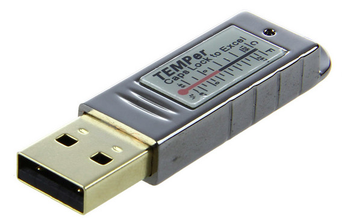
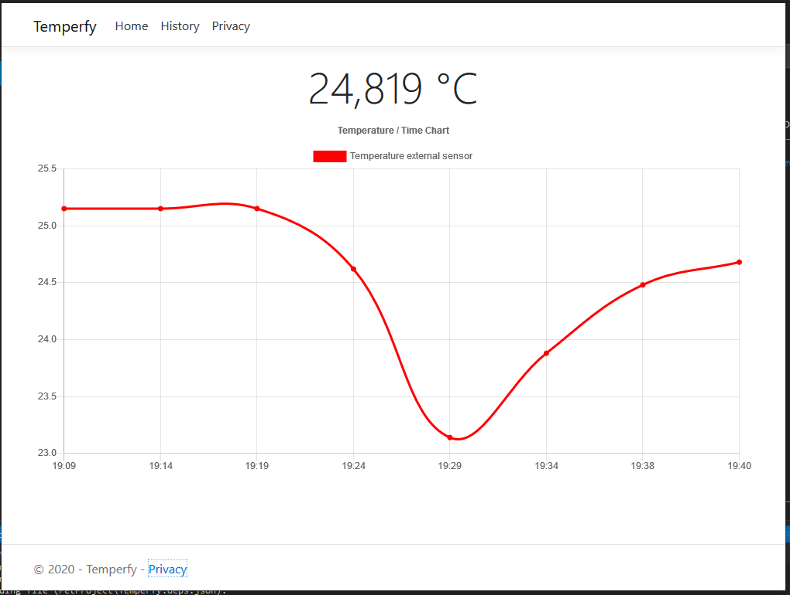
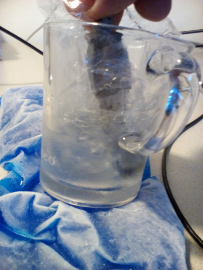
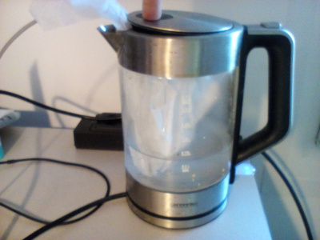

# Tempify

This repo summarizes the outcome of some hacking session to get data out of a cheap temperature sensor.

## Outcome

Putting all together in a web app:

## Calibration

I found no public information that leads to plausible values. I assumed, that scaling with documented (see other TEMPer projects) magic values do not fit to the device I got. Solution: Calibration.

Put your sensor into icy water and boiling water to get reference values and create a new magic factor.

## Other TEMPer projects fiddeling with TEMPer devices

- <https://github.com/urwen/temper>
- <https://github.com/padelt/temper-python>
- <https://www.codeproject.com/tips/1007522/temper-usb-thermometer-in-csharp>
- <https://qiita.com/shima_/items/9be9a1f00a8bd6751f23>
